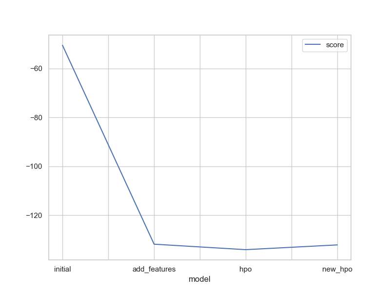

# Report: Predict Bike Sharing Demand with AutoGluon Solution

#### Saksham Kumar

## Initial Training

### What did you realize when you tried to submit your predictions? What changes were needed to the output of the predictor to submit your results?

- All predictions were needed to be positive for Kaggle Submission.

- Test data didn't have the casual and registered columns, so I had to ignore their importance in the final submission.

- Kaggle requires all predictions to be positive, so I had to apply a ReLU activation function to the predictions to ensure that all values were non-negative.

### What was the top ranked model that performed?

- Weighted_Ensemble_L3 scored the best on all the iterations of models. It is an ensemble model that combines the predictions of multiple models to improve accuracy, with equal weightage given to all weak learners.

- The score ranged from 1.76235 to 1.32235 on the leaderboard, which is explained in the top models section.

## Exploratory data analysis and feature creation

### What did the exploratory analysis find and how did you add additional features?

- Exploratory analysis found that the "season" and "weather" features were categorical, but they were being treated as numerical. I converted them to categorical features.

- Datetime features couldn't be used directly, so I created new features like "hour", "day", "month", and "year" from the datetime column.

### How much better did your model preform after adding additional features and why do you think that is?

- By specifying the model specific hyperparams, the time allocated for training each model was distributed more evenly as per the model's needs.

- The model was able to learn better from the data and make more accurate predictions.

## Hyper parameter tuning

### How much better did your model preform after trying different hyper parameters?

- Increasing the time limit works better for allowing AutoGluon to train more models.
- Though changing the presets from the default to "best_quality" to "experimental_quality". I expected for better results, but it almost gave the same, though a little worse score.

- Scheduler was set to "local", allowing better control over the training process and parallelization of the model execution.

- Number of Trials were incremented from 8 to 10, allowing AutoGluon to explore more hyperparameter combinations and find the best performing model.

- Presets were changed from "best_quality" to "good_quality" and "experimental_quality", which allowed AutoGluon to explore different hyperparameter combinations and find the best performing model.

- The model accuracy increased on changing from default params. The models showed little improvement in the score, but is significant in terms of the time taken to train the model.

- The final model was able to achieve a score of 1.32235 on the Kaggle leaderboard, lesser than the previous scores of 1.75757, 1.32783 and 1.32961.

### If you were given more time with this dataset, where do you think you would spend more time?

- I would experiment more with the hyperparameters and time limits, to reveal better results.

- I would work on finding feature correlations and try to remove some of the features that are not needed. Dimensionality reduction techniques like PCA could be used to reduce the number of features.

### Create a table with the models you ran, the hyperparameters modified, and the kaggle score.

| Model        | Scheduler | Num Trials | Presets              | Score   |
| ------------ | --------- | ---------- | -------------------- | ------- |
| initial      | default   | default    | best_quality         | 1.75757 |
| add_features | local     | 8          | good_quality         | 1.32783 |
| hpo          | local     | 10         | experimental_quality | 1.32961 |
| new_hpo      | local     | 10         | best_quality         | 1.32244 |

### Correlation matrix between features.

### Bike Sharing Demand Over Time

The demand is less in the winter months and more in the summer and monsoon months.

- The demand is peaks in the mid hours of day and evening, around 6 AM and 6 PM.

- Demand is even daily, with a slight increase on weekends.

### Create a line plot showing the top model score for the three (or more) training runs during the project.

### Create a line plot showing the top kaggle score for the three (or more) prediction submissions during the project.

### Model 4 Leaderboard

## Summary

The bike sharing demand prediction using AutoGluon is a great way to understand the demand patterns and make accurate predictions. It is helpful to understand data preprocessing, feature engineering, and hyperparameter tuning to create robust predictive models. In this work, four instances of AutoGluon were used to train the model, and the best performing model was selected based on the Kaggle score. The final model was able to achieve a score of 1.32244 on the Kaggle leaderboard.
